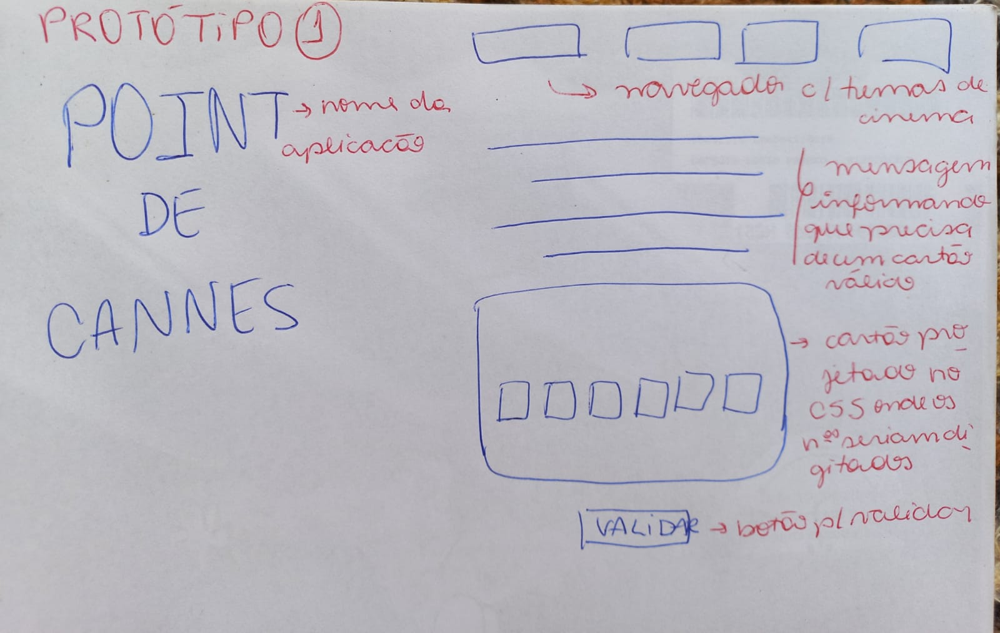

# Card Validation Project - Point de Cannes

## SUMÁRIO

- [1. Introdução](#1-Introdução)
- [2. Funcionamento](#2-Funcionamento)
- [3. Protótipos](#3-Protótipos)
- [4. Planejamento do Projeto](#4-Planejamento)
- [5. Aprendizado](#5-O-que-aprendi)
- [6. Ferramentas Ultilizadas ](#6-Ferramentas)
- [7. Sobre a autora](#7-Autora)

## 1. Introdução

A proposta do projeto Card Validation deu origem à aplicação Point de Cannes, uma plataforma de streaming voltada pra usuários cinéfilos e também espectadores que buscam conhecer mais do cinema, para além da bolha hollywoodiana. 
O serviço de streaming oferece aos novos usuários um teste gratuito de 30 dias para ser usuário Prèmiere, tendo acesso a conteúdos exclusivos e catálogos de filmes independetes e recém estreiados.

O conteúdo principal da página é uma mensagem informando que esse teste gratuito expirou, e para que o usuário continue sendo Prèmiere, deve informar um número válido de cartão de crédito.

## 2. Funcionamento

A base da validação do cartão é feita a partir do algorítimo de Luhn, (https://en.wikipedia.org/wiki/Luhn_algorithm). 

Esse algorítmo é simples. Obtemos o inverso do número a ser verificado (que
contém apenas dígitos [0-9]); todos os números que ocupam uma posição par devem
ser multiplicados por dois; se esse número for maior ou igual a 10, devemos
adicionar os dígitos do resultado; o número a verificar será válido se a soma de
seus dígitos finais for um múltiplo de 10.

Além disso, os dígitos devem ser mascarados (exceto os últimos 4), por questões de segurança. O cartão sendo válido, o usuário continua Prèmiere, caso contrário, terá que digitar outro número que seja válido.

## 3. Protótipo

Assim que decidi qual seria o projeto que faria (tinham duas opções), já imaginei o layout e fiz num papel:

Busquei algo simples, mas que entregasse um contexto para validar um cartão dentro de um tema que eu gosto. Mudei a paleta de cores algumas vezes e optei por deixar a cor das letras branca para maior contraste e fácil leitura. 

Os maiores desafios foram enquadrar todos os elementos do layout tirando a barra de rolagem e também clonar os dígitos do cartão enquanto o usuário digita. Detalhes importantes e que dão toda diferença, mas que optei deixar para últimos toques, já que o foco do meu aprendizado nesse projeto era entender a parte funcional.

## 4 .Planejamento do Projeto

O projeto Card Validation(Point de Cannes) tinha, preferencialmente, duração de 2-3 semanas para ser executado, desde protótipo, passando por código e testes. 

Para me planejar ultilizei a ferramenta Trello, que auxilia na parte de divisão de tarefas entre 'A fazer', 'Fazendo' e 'Feito'. Assim, tive auxílio para entender os pequenos passos que deveria tomar para construir o projeto.

Também foi importante o uso da planilha da Daily, que usamos em todos os dias de aula do bootcamp, para assim conseguirmos executar as tarefas colocando em perspectiva o que já fizemos e onde queremos chegar.

## 5.Aprendizado

Como já dito acima, meu objetivo principal nesse projeto era compreender mais lógica de programação num todo, então a princípio foquei menos no layout. Queria entender como a linguagem JavaScript funciona no detalhe, o uso e manipulação de DOM, funções, condições e loops.

Acho que além da parte técnica, começei a aprender a importância de manejar melhor o tempo e fazer planejamento para não desperdiçar as sprints, ensinamento valioso que levarei para os próximos projetos.

## 6.Ferramentas Ultilizadas

## Código:
-Visual Studio Code;
-Git. e Github (controle de versão e armazenamento em repositório).

## Organização:
-Trello;
-Metro Retro.

## Comunicação:
-Slack;
-Zoom;
-Google Meets;
-AnyDesk(para que uma colega pudesse acessar minha máquina e entedesse um problema no terminal).

## 7.Sobre a autora

Oi, me chamo Isabela e estou em transição de carreira desde 2021. Sempre gostei de aprender outros idiomas, e quando conheci o mundo da programação encontrei um meio de conhecer a linguagem das máquinas. É um mundo extenso, complexo e desafiador, tudo que me encanta. Comecei minha jornada na Laboratoria na turma 007-2022 e esse é meu primeiro projeto solo :⁾)

PS: Agradeço pela oportunidade da Laboratória, pelo apoio dos meus familiares e pela ajuda que recebi das outras alunas do bootcamp, em especial as do Squad 4. No fim o mérito é individual, mas a jornada pecorrida até atingir um objetivo é sempre repleta de contribuições de outras pessoas.